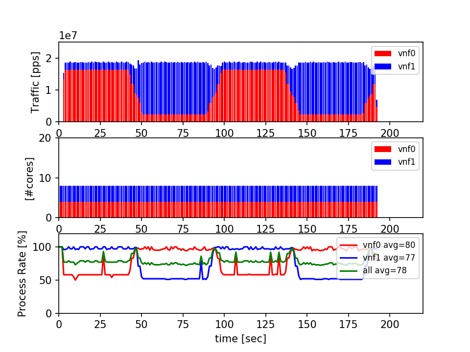
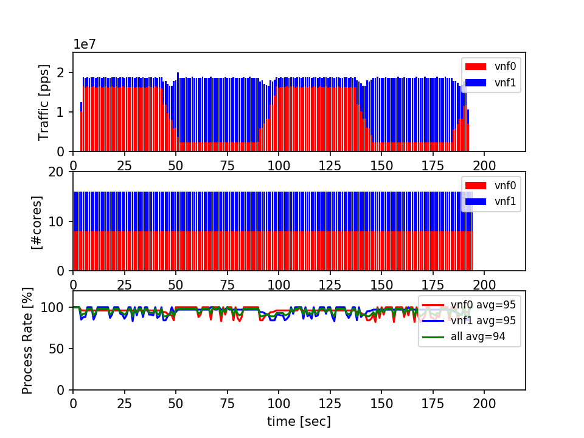
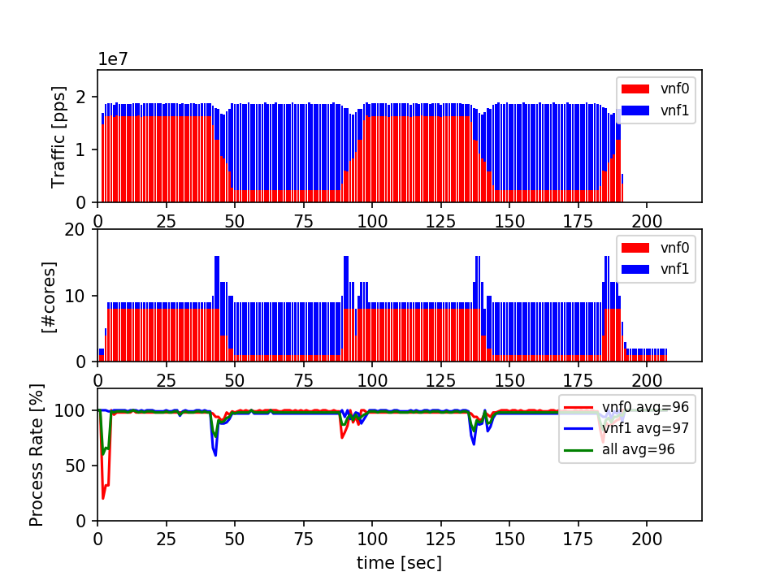

#  D2 Optimization Experiment Result

tuning parameter
```
    Milion = 1000000
    d2rules = {
        "d2out": 90,
        "d2in" : {
            "promiss": 90,
            "thresholds": [
                { 'ncore':2, 'threshold': (17*Milion*0.22) },
                { 'ncore':4, 'threshold': (17*Milion*0.35) },
                { 'ncore':8, 'threshold': (17*Milion*0.6) }
            ]
        }
    }
```

**Fixed Resourcing #core is 4 and 4**



**Fixed Resourcing #core is 8 and 8**



**D2 Auto Scaling**




