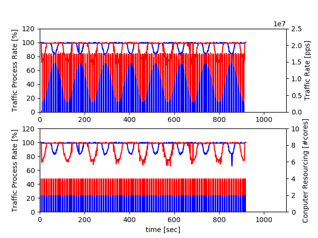
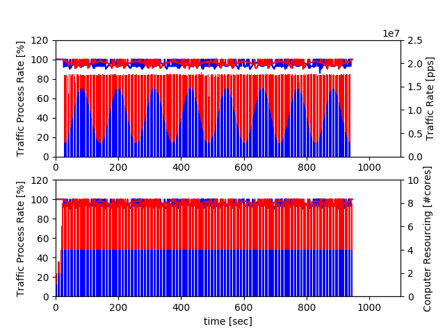
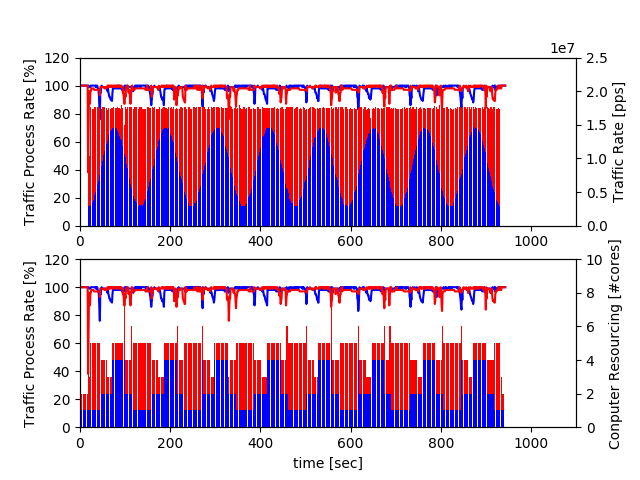

#  D2 Optimization Experiment Result

tuning parameter
```
    Milion = 1000000
    d2rules = [
            { 'ncore':2, 'threshold': (17*Milion*0.3) },
            { 'ncore':4, 'threshold': (17*Milion*0.6) } ]
```

**Fixed Resourcing #core is 2**



**Fixed Resourcing #core is 4**



**D2 Auto Scaling**


