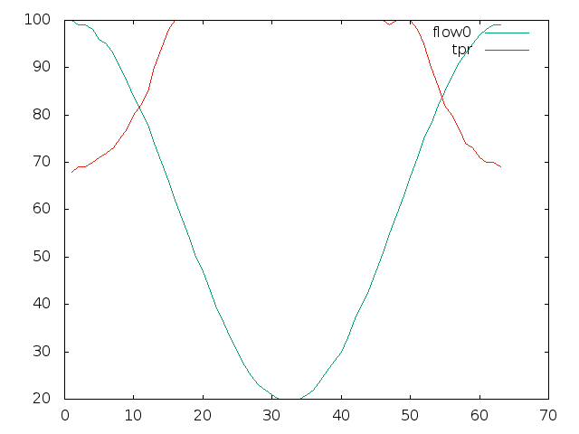
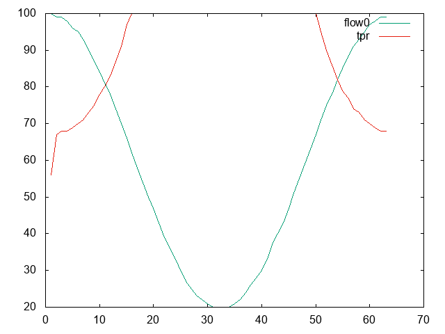

# D2を用いたトラフィック処理率の最適化

- slank.dev[at]gmail.com
- Hiroki SHIROKURA (@slankdev)

## 結果

**l2fwd1b, delay=none, n-thread=1**

```
Results
-----------------------
pktsize  : 64[Byte]
times    : 1[times]
avg-rx   : 9914[Mbps]
avg-tx   : 11569[Mbps]
proc-rate: 85[%]
```



**l2fwd1b, delay=none, n-thread=2**

```
Results
-----------------------
pktsize  : 64[Byte]
times    : 1[times]
avg-rx   : 9922[Mbps]
avg-tx   : 11689[Mbps]
proc-rate: 84[%]<Paste>
```




## 2Flowed SFC Resouce Tuning

**l2fwd-numa (using 1cores/chain, sum 2cores)**

```
pktsize  : 64
times    : 4
avg-rx   : 19562[Mbps]
avg-tx   : 23279[Mbps]
proc-rate: 84%
```

**l2fwd-ssn (using 1cores/chain, sum 2cores)**

```
pktsize  : 64[Byte]
times    : 4[times]
avg-rx   : 19490[Mbps]
avg-tx   : 23433[Mbps]
proc-rate: 83[%]
```


